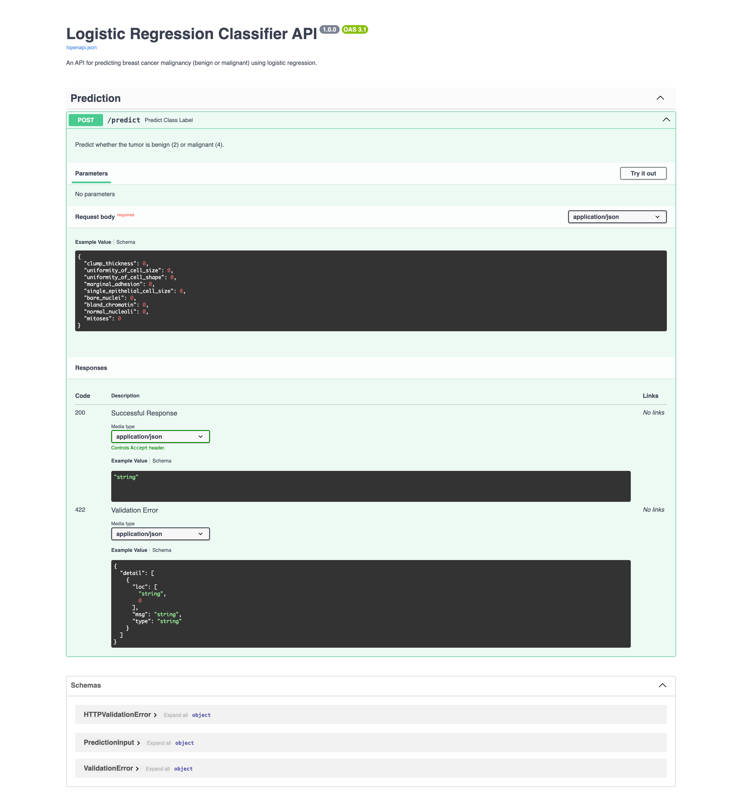

# Breast Cancer Prediction API (FastAPI)
This project provides an API for predicting whether a tumor is benign (class = 2) or malignant (class = 4) using a Logistic Regression model.

## Table of Contents
- [Description](#description)
- [Requirements](#requirements)
- [Getting Started](#getting-started)
- [Endpoints](#endpoints)
- [Example Input and Output](#example-input-and-output)
- [File Structure](#file-structure)
- [License](#license)

## Description

The FastAPI application loads the trained Logistic Regression model and exposes an endpoint for predictions.

## Requirements
To set up and run this project, you’ll need the following Python packages:

- `fastapi`
- `uvicorn`
- `scikit-learn`
- `pandas`
- `joblib`
- `numpy`

You can install these dependencies by running:
```bash
pip install -r requirements.txt
```

## Getting Started
1. Ensure the `model.pkl` and `scaler.pkl` files are in the `model/` directory.

2. The FastAPI application (`api.py`) loads the saved model and provides an endpoint for predictions. Run it using `uvicorn`:
  ```bash
  uvicorn api:app --reload
  ```
  This will start the FastAPI server at `http://127.0.0.1:8000`


## Endpoints


- POST /api/predict
  - Description: Accepts tumor feature values and returns a predicted class of tumor benign (2) or malignant (4).
  - Input JSON:
  ```bash
  {
    "clump_thickness": 1,
    "uniformity_of_cell_size": 2,
    "uniformity_of_cell_shape": 3,
    "marginal_adhesion": 4,
    "single_epithelial_cell_size": 5,
    "bare_nuclei": 6,
    "bland_chromatin": 7,
    "normal_nucleoli": 8,
    "mitoses": 9
  }
  ```
  - Output JSON:
  ```bash
  {
    "prediction": 4,
    "label": "Malignant"
  }
  ```

## Example Input and Output
Example Input:

Clump Thickness = 5  
Uniformity of Cell Size = 3  
Uniformity of Cell Shape = 3  
Marginal Adhesion = 2  
Single Epithelial Cell Size = 3  
Bare Nuclei = 4  
Bland Chromatin = 3  
Normal Nucleoli = 2  
Mitoses = 1 

Example Output:

Prediction: 2  
Label: Benign 


## File Structure
The project directory is structured as follows:

```
📦 logistic_regression_classifier_api
├─ model
│  ├─ model.pkl
│  └─ scaler.pkl
├─ src
├─ .gitignore
├─ api.py
├─ README.md
└─ requirements.txt
```
## License
This project is licensed under [](https://opensource.org/licenses/MIT)